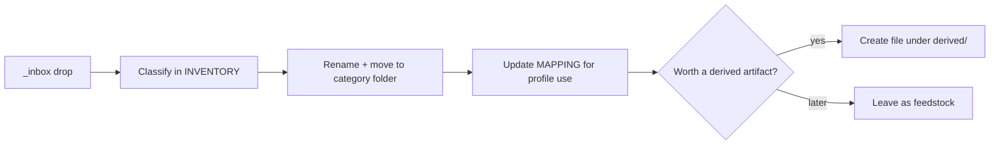

# Standalone Academic / Profile Library Plan

> **Status:** Planned (planning docs saved; scaffold not implemented yet)  
> **For agentic workers:** Implement Phase 1 scaffold task-by-task from the checklist below. Do not wire Brainjob `documents.json` in this phase.

**Goal:** Scaffold a standalone academic/profile source library at `profile/` with naming conventions, inventory/mapping templates, and an intake workflow so external materials can be dropped in later without reorganizing.

**Architecture:** Repo-root `profile/` sits beside `brainjob/`, `docs/`, and `skills/`. Phase 1 is folders + markdown only. Brainjob attachment storage (WBS 2.8) stays Planned as a later phase once distilled CV/portfolio artifacts exist.

**Origin:** Initial plan to organize profile source files; decided against early Brainjob wiring because materials are still external and the first need is academic/profile feedstock organization.

## Why standalone (not Brainjob-wired)

- Initial scope is review and organize academic/profile feedstock, not job-submission plumbing.
- Files are still external; wiring `documents.json` now invents paths Brainjob does not use yet.
- Academic materials and application CVs have different lifecycles: organize sources first, distill CV/portfolio later, then link into Brainjob.
- Keeps `brainjob/` focused on job JSON; avoids mixing binaries into the job-tracker package.
- Brainjob WBS **2.8** (attachment storage) stays **Planned** as a follow-on.

## Decisions (locked)

| Decision | Choice |
|----------|--------|
| Library root | `profile/` at repo root |
| Brainjob wiring | None in Phase 1 |
| Binaries in git | Track curated/renamed materials you want versioned; ignore `_inbox/` and large `raw/` dumps |
| Phase 1 code changes | Folders + markdown conventions only; no Python/schema changes |
| Derived profile outputs | `profile/derived/` holds CV/portfolio/writing extracts once created; still not linked to jobs yet |

## Folder structure

```
profile/
├── README.md              # conventions, intake, deferred Brainjob note
├── INVENTORY.md           # living file inventory (empty until intake)
├── MAPPING.md             # source → profile use (bio bullet, skill, writing sample, etc.)
├── _inbox/                # drop zone for unclassified external files
│   └── .gitkeep
├── academic/              # syllabi, course docs, transcripts-related
│   └── .gitkeep
├── writing/               # academic writing, essays, papers
│   └── .gitkeep
├── research/              # research notes, lit reviews, data notes
│   └── .gitkeep
├── projects/              # course projects and assignment outputs
│   └── .gitkeep
├── reference/             # supporting docs not for direct profile use
│   └── .gitkeep
└── derived/               # distilled profile artifacts (CV drafts, portfolio pieces)
    ├── cv/
    ├── portfolio/
    └── excerpts/
```

## Naming convention

Pattern (ASCII, underscore-separated, no spaces):

```
{doctype}_{subject_or_course}_{topic}_{yyyy}[_v{n}].{ext}
```

| Segment | Rules | Examples |
|---------|-------|----------|
| `doctype` | `syllabus`, `assignment`, `paper`, `project`, `notes`, `ref`, `cv`, `portfolio`, `excerpt` | `syllabus`, `paper` |
| `subject_or_course` | short slug | `eu_governance`, `climate_policy` |
| `topic` | short slug for the specific work | `final_essay`, `week03` |
| `yyyy` | year of the material or version | `2024` |
| `v{n}` | optional version | `v1` |
| `ext` | prefer `pdf` or `md` for curated files; keep originals if needed | |

Examples:

- `syllabus_eu_governance_overview_2024.pdf`
- `paper_climate_policy_adaptation_governance_2025_v1.pdf`
- `project_food_systems_stakeholder_map_2025.pdf`
- `cv_master_2026_v1.pdf` (under `derived/cv/` once created)

## Phase 1 deliverables

1. **File inventory** -- `profile/INVENTORY.md`: original name, proposed path, category, relevance (`profile` / `feedstock` / `skip`), format status, notes.
2. **Category + folder structure** -- tree above.
3. **Naming convention** -- in `profile/README.md`.
4. **Formatting/conversion backlog** -- `format_status` column in inventory (`ok` / `needs-format` / `needs-convert`).
5. **Source → profile mapping** -- `profile/MAPPING.md`: source file → profile use (not job IDs yet).
6. **Prioritized WBS** -- section 14 in [work-breakdown.md](../work-breakdown.md); leave Brainjob 2.8 Planned.
7. **Next steps** -- intake checklist in `profile/README.md`.

## Implementation checklist (Phase 1 scaffold)

- [ ] Create `profile/` tree with `_inbox`, `academic`, `writing`, `research`, `projects`, `reference`, `derived/{cv,portfolio,excerpts}` and `.gitkeep` files
- [ ] Write `profile/README.md` (naming rules, categories, git policy, intake checklist, deferred Brainjob note)
- [ ] Add empty `profile/INVENTORY.md` and `profile/MAPPING.md` templates
- [ ] Add `.gitignore` rules for `profile/_inbox/*` (keep `.gitkeep`) and `profile/**/raw/`
- [x] Save this plan under `docs/plans/` and update planning docs / WBS status

## Intake workflow (when external files arrive)



Priority order for first intake batch:

1. Drop everything into `profile/_inbox/`
2. Syllabi and course overviews → `academic/`
3. Papers / essays → `writing/`
4. Projects and graded outputs → `projects/`
5. Research notes → `research/`
6. Mark profile-relevant items in MAPPING; only then create `derived/` artifacts

## Deferred (Phase 2 -- not this work)

- Wire `derived/cv` and `derived/portfolio` into Brainjob (`brainjob/documents/` + `documents.json`) -- relates to WBS 2.8
- Path-existence validation in `brainjob validate`
- Dashboard attachment previews
- Git LFS
- Personal website extraction

## Related docs

- [Work breakdown](../work-breakdown.md) section 14
- [Docs index](../README.md)
- Brainjob attachment convention remains Planned: WBS 2.8
